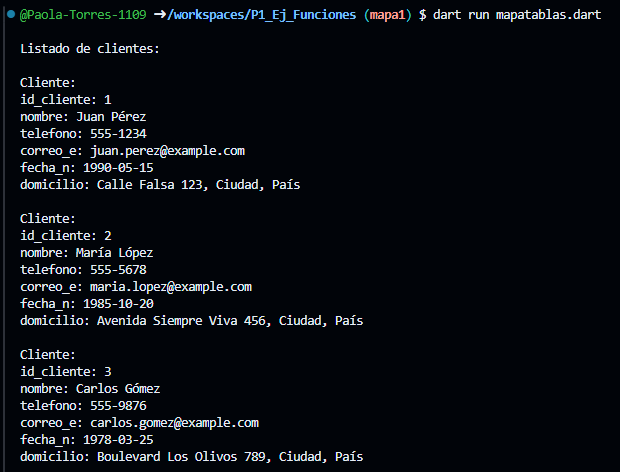
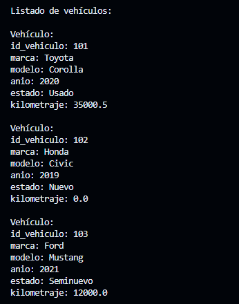
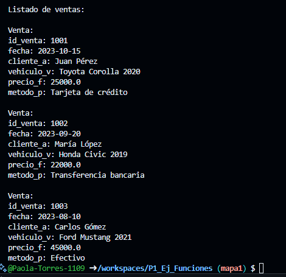

crear map <string, dinamic> cliente con los siguientes key, id_cliente, nombre, telefono, correo_e, fecha_n y domicilio.  y mostrar los datos con un foreach lenguaje dart

crear map <string, dinamic> vehiculo con los siguientes key, id_vehiculo, marca, modelo, anio, estado y kilometraje.  y mostrar los datos con un foreach lenguaje dart

crear map <string, dinamic> ventas con los siguientes key, id_venta, fecha, cliente_a, vehiculo_v, precio_f y metodo_p.  y mostrar los datos con un foreach lenguaje dart
