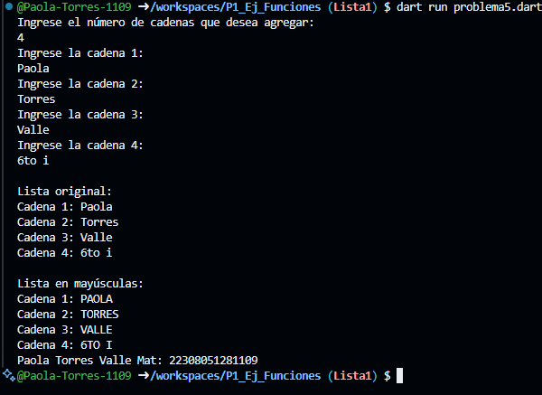

Crea un programa que tome una lista de cadenas (string) y devuelva una nueva lista con todas las cadenas convertidas a mayúsculas, que utilice 2 funciones una para capturar datos de la lista y otra para mostrar los elementos
